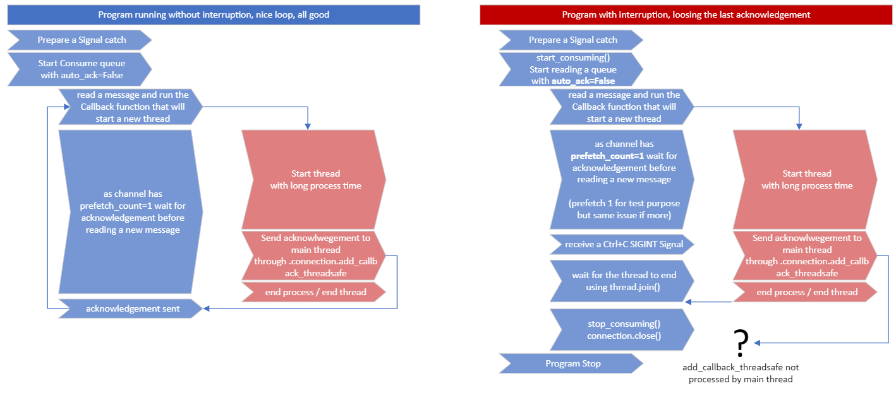

# pika_add_callback_threadsafe_error
Code that reproduce an issue with pika add_callback_threadsafe when interrupting consume.

Issue : Ctrl+C freeze the channel that don't process the .connection.add_callback_threadsafe during the thread.join()

Sample of debug print wjhen calling the function. If no interruption the `DEBUG ack_message : Acknowledgement delivered` is printed after `message0` is processed.
Next iteration, if there is a `^C` the thread process the `message1` but don't acknowledge.

```
$ python test_pika_blockthread.py
DEBUG main : queue test_ctrlC purged
DEBUG main : test messages created in test_ctrlC
 [*] Waiting for messages. To exit press CTRL+C
DEBUG block_process : start of block_process function
DEBUG block_process : message processed is message0
DEBUG preprare delivering Acknowledgement from thread
DEBUG block_process : end of block_process function
DEBUG ack_message : begining of ack_message function
DEBUG ack_message : Acknowledgement delivered
^C2022-11-23 10:22:24.849907 0:00:34.146291 Exit signal received (2)
DEBUG block_process : start of block_process function
DEBUG block_process : message processed is message1
DEBUG preprare delivering Acknowledgement from thread
DEBUG block_process : end of block_process function
$
```

In the code pika to process RabitMQ message by small batch, and using a thread for each batch.
At the end of the function in the thread, the code send acknowledgement of the messages through add_callback_threadsafe to the channel.

In parallele the code is catching SIGINT signals to stop the program properly, by waiting with thread.join() that all threads finish before stopping the channel consume and closing the connection.

But once the CtrlC is sent to generate the SIGINT, event if the program wait for all threads to finish, the acknowledgement will not be processed.

__==> is there a way to force the channel/connection to process the waiting add_callback_threadsafe before closing the connection ?__



(note : in the code, you need to change the connection info to RabbitMQ like host, port, login, password line 107 to 111)

Versions :

- Python 3.7.13
- pika 1.3.1
- RabbitMQ 3.6.10
